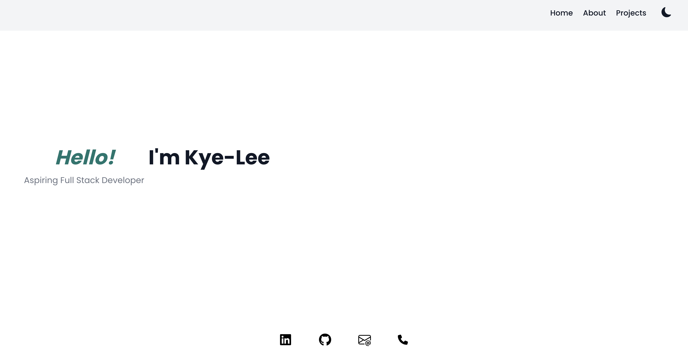

# Kye-Lee Low Personal Portfolio
A Personal Portfolio featuring a Home Page, About Me and Projects Page.

Click this link for a live demo: [Kye-Lee-Personal-Portfolio](https://www.kyelee.dev)

## Overview
**Tech used:** Next.js, Typescript.js, React.js, Typed.js(npm), Javascript, HTML, CSS, Tailwind

This Personal Portfolio is built using Next.js and features the ability to switch between light and dark modes. The Home Page utilises Typed.js(npm) to display animated typing of greetings. Here you will also find links to my LinkedIn, GitHub, Email Address and Phone Number. The About Me Page includes my profile photo, a brief overview about me and the programming languages I have used in my personal projects. On the Projects Page, you will find some personal projects I have worked on and deployed using Amazon Amplify.
